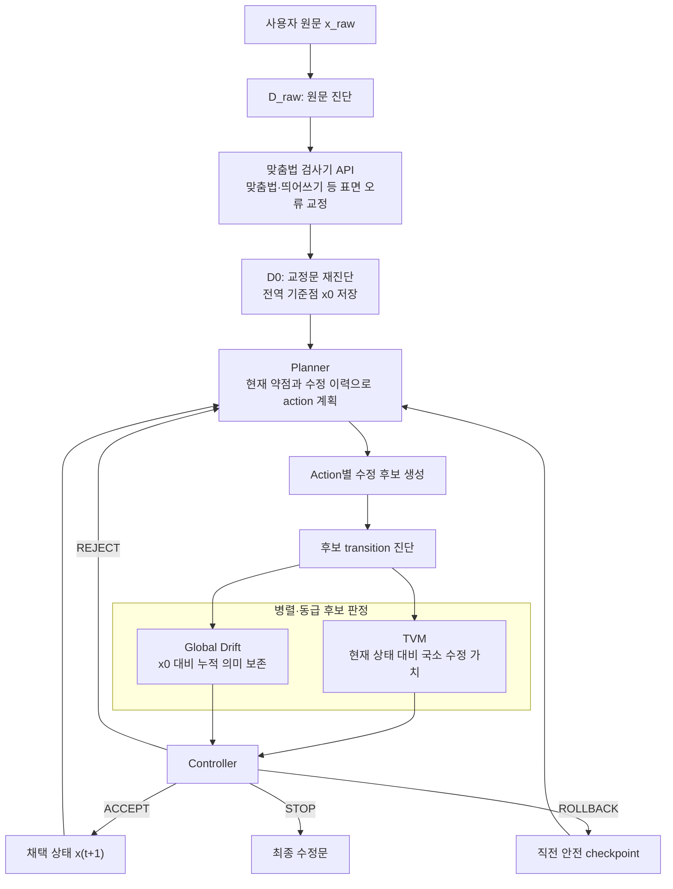

# FEAK-Agent 전체 프레임워크 핵심 정리

- 기준 커밋: `5f75044` (`corruption_data`)
- 범위: 기준 커밋 이후 확정한 전체 구조와 corruption 데이터의 역할

## 1. 전체 구조

FEAK-Agent는 한 번에 글을 다시 쓰는 시스템이 아니라, 작은 수정 transition을 반복 평가·제어하는 writing agent다.



구성요소의 역할은 다음과 같다.

- 진단기: rubric 점수와 linguistic feature로 현재 약점을 관찰한다.
- 맞춤법 검사기: Planner 전에 기계적인 맞춤법·띄어쓰기 문제를 처리한다.
- Planner: 교정 후에도 남은 내용·조직·표현 문제에 맞는 다음 action을 계획한다.
- 후보 생성기: 동일 action에 대해 여러 수정문을 만든다.
- TVM: `현재 글 → 후보 글` 한 번의 국소 transition 가치를 평가한다.
- Global Drift: 최초 교정문 `x0`에서 핵심 주장·사실·과제 요구가 누적 변질됐는지 평가한다.
- Controller: 두 판정을 함께 받아 `ACCEPT / REJECT / ROLLBACK / STOP`을 결정한다.

TVM과 Global Drift는 순차 종속 관계가 아니라 같은 후보를 동시에 보는 독립 판정기다. 심각한 Drift는 TVM 점수가 높아도 hard veto할 수 있어야 한다.

## 2. corruption 데이터의 역할

corruption 데이터는 좋은 글을 의도적으로 훼손해, 반대 방향의 올바른 수정 action과 transition을 학습하기 위한 합성 데이터다.

| Corruption operator | 훼손 rubric | 복구 action |
|---|---|---|
| `DELETE_SPECIFICS` | `content_2` | `ADD_DETAIL` |
| `SHUFFLE_FLOW` | `organization_1` | `RESTRUCTURE` |
| `INSERT_OFFTOPIC` | `organization_2` | `DELETE_OR_FOCUS` |
| `INJECT_LEX_REPEAT` | `expression_1` | `STYLE_REFINE` |
| `INJECT_GRAMMAR_ERR` | `expression_2` | `STYLE_REFINE` |

feature를 목표값에 맞춰 훼손하지 않는다. operator로만 텍스트를 바꾸고, feature는 생성 후 검증에만 사용한다.

## 3. 생성과 채택 과정

글 한 편에 세 operator를 순차 적용해 multi-step chain을 만든다.

```text
stage 0: 원문
  → corruption 1
stage 1
  → corruption 2
stage 2
  → corruption 3
stage 3
```

각 단계에는 다음 정보가 기록된다.

- 훼손 전후 텍스트
- `corruption_op`, `reverse_action`, `target_rubric`
- 보존조건과 실제 edit
- 전후 rubric 및 feature
- target rubric 하락 폭과 채택 여부

생성 후 채점기와 feature를 다시 측정하고, target rubric이 noise margin 0.3보다 크게 하락한 transition만 채택한다.

현재 최신 `rulev2` 결과는 다음과 같다.

```text
30 essays × 3 steps = 90 generated transitions
47 accepted transitions
```

TVM 학습에는 원칙적으로 인접 transition을 사용한다.

```text
stage 0 → 1
stage 1 → 2
stage 2 → 3
```

stage gap이 2 이상인 쌍은 여러 훼손이 누적될수록 선호가 단조롭게 낮아지는지 확인하는 별도 검증용이다.

## 4. 현재 확인된 설계 보완점

### 기계적 어법 오류

현재 `INJECT_GRAMMAR_ERR`가 만드는 조사·띄어쓰기·철자 오류는 실제 실행에서 맞춤법 검사기 API가 먼저 처리한다. 따라서 이는 TVM의 핵심 `STYLE_REFINE` 데이터보다 `D_raw → 맞춤법 API → D0` surface transition 검증용으로 분리하는 것이 맞다.

맞춤법 검사 후에도 남는 문장 호응·모호한 표현 등만 Planner와 TVM의 고차원 `STYLE_REFINE` 대상으로 본다.

### `DELETE_SPECIFICS`

구체정보만 삭제해야 하지만 기존 어법 오류나 주제 이탈까지 함께 정리되는 사례가 있었다. 지정 span 외 문장 재작성·교정이 발생하지 않는 보존 검사가 필요하다.

### `SHUFFLE_FLOW`

문장 위치만 바뀌고 독자가 체감하는 논리 흐름은 거의 달라지지 않는 사례가 있었다. 실제 선후관계·접속·지시 관계가 깨진 경우만 유효한 훼손으로 본다.

## 5. 현재 검증 상태

Codex의 최신 `rulev2` 50쌍 블라인드 감사는 47/50, 94.0% 일치했다. 다만 이는 AI 평가이며 실제 사람 선호 평가가 아니다.

```text
G2 official status = pending_human_review
```

`human_review_50.jsonl`은 corruption 본체가 아니라 operator와 정답을 숨긴 A/B 평가용 view다. 실제 operator, action, edit, 재측정값은 `chains`, `audit`, `accepted` 파일에 기록된다.

핵심 데이터:

- `experiments/results/corruption_g1_gpt5mini_rulev2_30_chains.jsonl`
- `experiments/results/corruption_g1_gpt5mini_rulev2_30_audit.jsonl`
- `experiments/results/corruption_g1_gpt5mini_rulev2_30_accepted_m03.jsonl`
- `experiments/results/corruption_g2_gpt5mini_rulev2_human_review_50.jsonl`
- `experiments/results/corruption_g2_gpt5mini_rulev2_human_key_50.jsonl`
